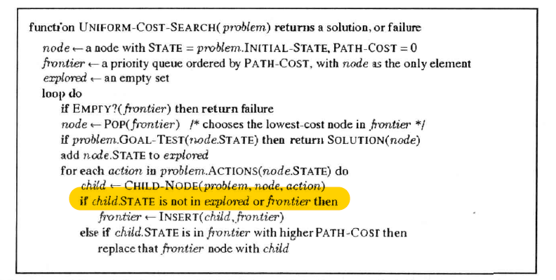
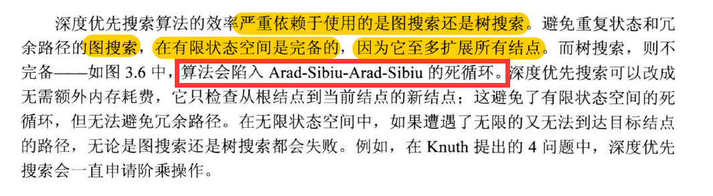

## 算法属性总结表

| 算法         | 完备性            | 最优性         | 时间复杂度                   | 空间复杂度 |
| ------------ | ----------------- | -------------- | ---------------------------- | ---------- |
| 宽度优先搜索 | 完备              | 特定条件下最优 | $b^d$                        | $b^d $     |
| 一致代价搜索 | 有零代价时不完备  | 最优           |                              |            |
| 深度优先搜索 | 树搜索不完备(...) | 不是最优的     | $b^m$                        | $bm$       |
| 深度受限搜索 | l<d时不完备       | l>d时不是最优  | $b^l$                        | $bl$       |
| 迭代加深的~  |                   | 不最优         | $ b^d $, d为最浅目标结点深度 | $bd$       |

## 各算法分析

### 宽度优先搜索

**完备性原因**: 

能够到达目标节点就是完备的了.  但不一定是最优.

**特定条件下最优**: 比如走有障碍物方格中最快找到的点. 

## 困惑

1. 宽度优先搜索的复杂度分析. 

    为什么要以状态空间的方式? 而不是直接分析结点的数量和边的数量 $O(E+V)$ ?这样准确的多. 而$b^d$ 太模糊了. 

    

2. 一致代价搜索的**零代价死循环**. 

    

    为什么会进入死循环? 难道不保存**是否访问过状态**吗? 如果是, 那为什么不保存?

    在宽度优先搜索里, 是要保存的, 否则就会无限循环. 为什么一致代价搜索不保存. 保存了的话, 零代价有什么影响?

    而且在它的伪代码里, 有一个explored集合代表是否访问过. 这和上面的结论有冲突啊. 

    

3. 深度优先的树搜索

    保存全局访问状态的深度优先是深度优先, 不保存而遍历出整个搜索树的也是深度优先. 

    

    