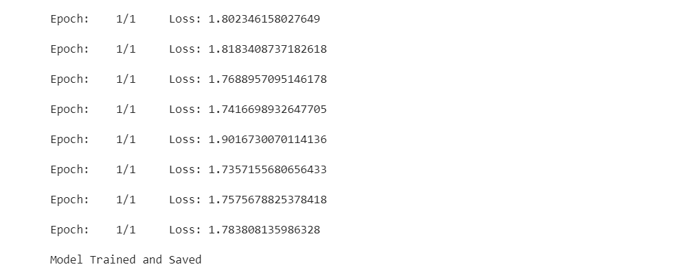

# lstm生成cpp代码项目

## 第一版想法

## 步骤
 - [x] 获取并整合我自己写的cpp代码(考虑将每个cpp文件独立出来)
 - [x] 分隔所有的原子单位, 并转化为以0开始的整数
 - [x] 生成lstm输入的序列(因为每个文件独立, 所以对每个文件获取若干个序列)
 - [x] 定义网络, 使用pytorch的embedding和lstm模型
 - [x] 定义超参数
 - [x] 训练模型, 调参, 保存模型
 - [x] 运行模型, 得出生成的代码, 自动格式化(如果做得到)
 - [x] 预测时多输入序列

## 问题点
 - [x] 关键字较少, 模式非常类似.

## 第一版结果

训练的loss值. 其实整个训练的中后期一直是这个值左右.


### include开头
```cpp
#include <cmath>
#include <vector>
usingname space std;
intmain() {
    long long a[4] = { {-1, 1, 3, 3, 3, 5, 3, 4, 5, 5, 6, 7, 9, 3, 3}, {1, -2, --3, -1, 1, 3, 2, 3, 3, -3, 3};
    intn, m, k, k = 0, j = 0;
    while (n[i] != 0) {
        //cin.get();
        for (intj = 0; j < n; ++j)
            if (a[i] != '1')&&str[i]<='z'))cout<<"\n当前链表为:";
        list_1.print();
        list_1.push_back(3);
        list_1.push_back(i);
        for (inti = 0; i < 3; i++) {
            cout << a[i];
        }
        /*251231423535154233635345646565*/ /*4556344432455445453654636364565454454345668999678867791097842124264643543577899998848784214433665689645563422545564224643334435244423685445456456799888888888888888888888888888888822888888888888888888888888*//*412433423445436568986
```

### main开头
```cpp
main() {
    int n, m;
    cin >> n;
    for (int i = 2; i < = n; + +i) {
        if (str[i] = = ' 1 ') {
            cout < < " \ n当前链表为 : \ n ";
            for (int j = 1; j < = n; + +j) {
                for (int j = 0, j = i; j < = 10; + +j) {
                    cin >> a[i];
                }
            }
            cout < < ans;
        }
```

### #include<iostream>开头
```cpp
#include < iostream >
#include < vector >
using namespace std;
int main() {
    int a[1001], n, i = 0;
    for (register int i = 0; i < n; + +i) {
        cout < < n[i];
        cout < < endl;
    }
    int n, m, m;
    cin >> n;
    for (int i = 1; i < = n; + +i) {
        cin >> a >> b;
        for (int i = 1; i < = 4; i + +) {
            if (!vis[v][i] & &s[j + +] = = 0) return false;
        } if ((i + 1 ) % 2 = 1 ; if (n < = m ) {
            if (i = = 0) {
                tmp + = intToStr(f _ m, i, x, y, y);
            } }
    }
    void loop(int x) {
        for (int i = 1; i < = 10; i + +) {
            for (int j = 1; j < = n; + +l) {
                / /
            }
            cout < < " No \ n \ n ";
            / / cout < < " - - - - - - - - - - - - - - - - - - - - - - " < < endl;
            cout < < endl;
        }
    }
}
```

其他可在generate文件夹中查看